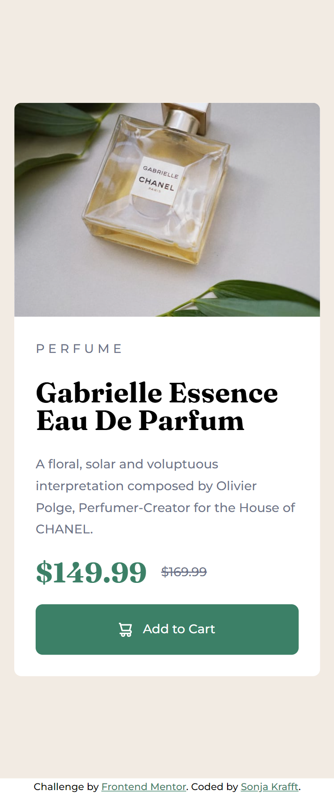
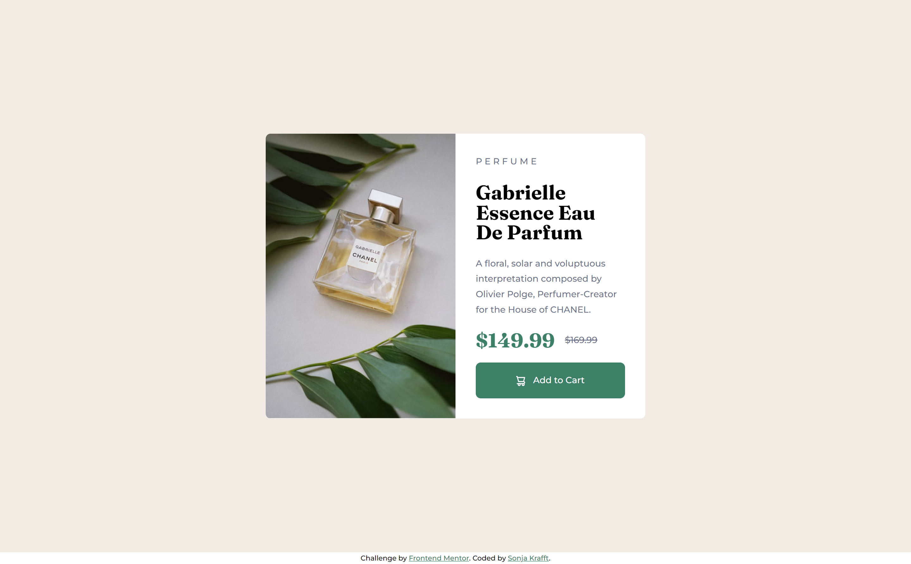

# Frontend Mentor - Product preview card component solution

This is a solution to the [Product preview card component challenge on Frontend Mentor](https://www.frontendmentor.io/challenges/product-preview-card-component-GO7UmttRfa). Frontend Mentor challenges help you improve your coding skills by building realistic projects. 

## Table of contents

- [Overview](#overview)
  - [The challenge](#the-challenge)
  - [Screenshot](#screenshot)
- [My process](#my-process)
  - [Built with](#built-with)
  - [What I learned](#what-i-learned)
- [Author](#author)

## Overview

### The challenge

Users should be able to:

- View the optimal layout depending on their device's screen size
- See hover and focus states for interactive elements

### Screenshot




## My process

### Built with

- Flexbox
- HTML and SCSS
- Mobile-first workflow
- Webstorm with pre-built server and File Watcher with SCSS for building CSS


### What I learned

- Improved the workflow with .jpg designs. First, analyze the design files with colored boxes. Then, start structuring and coding.
- Flexbox: the proportions of flexbox are computed without the size of the padding when `box-sizing: border-box` 
- `flex-direction: row` and `flex-direction: column` depending on device
- different images depending on device: `background-image: url('/images/image-product-mobile.jpg');`
- for the container: use full height of screen (finally)
```css
.container {
  display: flex;
  align-items: center; 
}
```
## Author

- Github - [Sonja Krafft](https://www.github.com/sonmikrafft)
- Frontend Mentor - [@sonmikrafft](https://www.frontendmentor.io/profile/sonmikrafft)